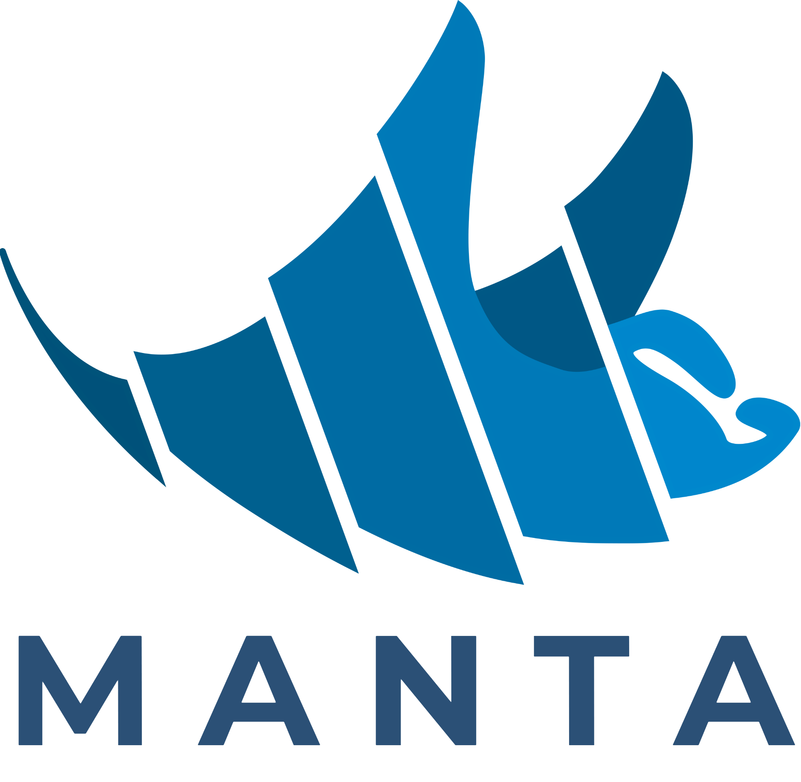

    <picture>
        <source srcset="img/manta-logo.png" media="(prefers-color-scheme: dark)">
        <!--<source srcset="img/lumiere-256.png" media="(prefers-color-scheme: light)">-->
        
    </picture>

**MANTA** (**M**ulti-scale **A**lignment for **N**-dimensional **T**ranscriptome **A**nalysis) is a next-generation Python framework for the alignment, reconstruction and downstream analysis of transcriptome data across all spatial and temporal dimensions.

<h2>Getting Started</h2>

<h3>Installation</h3>

In order to use MANTA, make sure you have a valid CUDA installation (12 or higher, verify using `nvcc --version`) and Conda available on your system.

1. Create a Conda environment using `conda create --name myenv --file manta.yml`

<h2>Usage</h2>