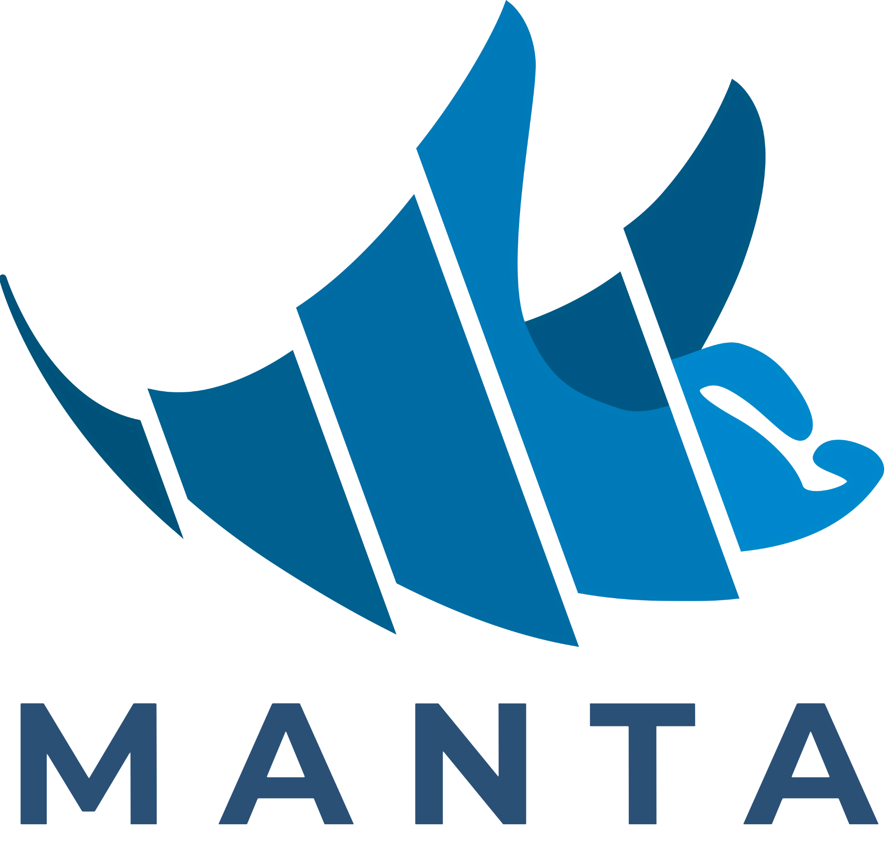

<p align="center">
    <picture>
        <source srcset="img/manta-logo.png" media="(prefers-color-scheme: dark)">
        <!--<source srcset="img/lumiere-256.png" media="(prefers-color-scheme: light)">-->
        
    </picture>
</p>

**MANTA** (**M**odular **A**nalysis from **N**-dimensional **T**ranscriptome **A**lignment) is a next-generation Python framework for the alignment, reconstruction and downstream analysis of transcriptome data across all spatial and temporal dimensions.

<h2>Getting Started</h2>

Tutorials on how to use MANTA can be found in `/notebooks`. 

<h3>Installation</h3>

In order to use MANTA, make sure you have a valid CUDA installation (13 or higher, verify using `nvcc --version`). 

1. Create a novel Conda environment from [rapids-singlecell](https://rapids-singlecell.scverse.org/en/latest/installation.html). 
2. (Optionally, install the `uv` package manager)

    ```pip install uv``` 

3. Make sure `torch`, `torch-geometric` and `pyg-lib` are properly installed. 

    <details>
    <summary>PyTorch Installation</summary>
    
    1. Install PyTorch as usual, together with `torch-geometric`
    
        ```uv pip install torch torchvision torch-geometric```

    2. Install pyg-lib 

        ```uv pip install pyg-lib -f https://data.pyg.org/whl/torch-{TORCH}+{CUDA}.html```

        where `TORCH` is your PyTorch version and `CUDA` your cuda version (check with `nvcc --version`)

    </details>

4. Install MANTA (locally) by navigating to the MANTA folder

    ```
    git clone https://github.com/PolyRocketMatt/MANTA.git
    cd MANTA
    uv pip install -e .
    ```

7. Install [concord-sc](https://github.com/Gartner-Lab/Concord)

    ```uv pip install concord-sc```

<h3>Copyright</h3>

MANTA is free software licensed under the <a href="https://www.gnu.org/licenses/gpl-3.0.html">GNU General Public License v3.0</a>. The MANTA logo was created by Mika Haenen and is used with permission.